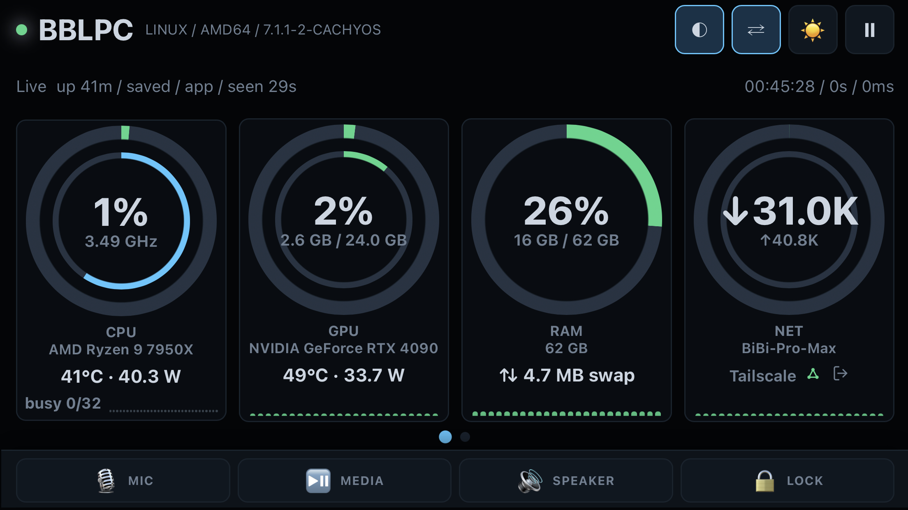

# Sysmon Agent

**Turn any old phone into a live system monitor for your PC.** One small binary serves a
beautiful dashboard — CPU, GPU, RAM, disk, network, temperatures, and power — as an
installable web app you add to your Home Screen. The host does all the work; the device
just paints the screen.

<p align="center">
  
</p>

---

## See it live

The dashboard below is running on an **iPhone 8 Plus (2017)** as a Home-Screen web app —
**no cable, no companion app to install, no GPU.** The phone is just on Wi-Fi painting
HTML; every sensor is read on the host PC and pushed over the network. That's why a
years-old handset with nothing plugged in makes a perfect, near-zero-power desk monitor.

| Idle | Under CPU load |
| :---: | :---: |
|  |  |
| Gauges tick live at a glance | Same phone, host under load — the CPU **clock ring fills** and the temperature crosses its threshold and turns **amber**, in real time |

---

## Highlights

- 📱 **Installable PWA** — add it to any phone, tablet, or browser Home Screen. Runs great
  on old hardware.
- 🪶 **Light on the device** — the host collects everything and streams it; the phone only
  renders, so there's **no GPU use and almost no battery/CPU cost** on the device. Old,
  wireless, and always-on is exactly the point.
- 🧊 **Single binary, zero dependencies** — stdlib-only Go with all assets embedded. One
  file per OS, nothing to install alongside it.
- 🖥️ **Full-system telemetry** — CPU, GPU, RAM, disk, network, temperatures, and power,
  refreshing live over Server-Sent Events.
- 🎛️ **At-a-glance gauges** — concentric rings (CPU utilization outer, **core-clock
  inner**), a small live trend per card, and amber/red warning thresholds.
- 🔘 **Quick controls** — mute mic, play/pause media, mute speaker, and lock the screen
  straight from the dashboard footer.
- ♻️ **Graceful degradation** — a sensor that can't be read shows `unavailable` with a
  reason; it never breaks the rest of the dashboard.
- 🐧 🪟 **Cross-platform** — Linux (`/proc` + sysfs + RAPL) and Windows (PowerShell + an
  embedded LibreHardwareMonitor bridge for CPU power and board temps).

---

## Get started

### Windows — one click

Download the latest **`SysmonAgent-Setup-<version>.exe`** from the
[**Releases page**](https://github.com/vantuan5644/sysmon-agent/releases/latest) and
double-click it. The wizard installs a background service, opens the firewall, and adds a
dashboard shortcut. The build is unsigned, so Windows SmartScreen shows a one-time
**"Windows protected your PC" → More info → Run anyway**.

### Linux / build from source

Needs **Go 1.22+** (only to build — a prebuilt binary has no Go requirement).

```bash
git clone https://github.com/vantuan5644/sysmon-agent system-monitor
cd system-monitor
./build.sh                 # -> ./sysmon-agent
./sysmon-agent             # serves on 0.0.0.0:9099
```

Open `http://HOST_IP:9099/` from any device on the same network.

### Add it to your phone

The dashboard is an installable PWA. Browsers only allow "install" over HTTPS, and the
easiest way to get that is [Tailscale Serve](https://tailscale.com/kb/1312/serve) (no
certificates to manage):

```bash
# agent already listening on 127.0.0.1:9099
sudo tailscale serve --bg --https=9443 http://127.0.0.1:9099
```

Open `https://TAILSCALE_HOST:9443/` on the device → **Add to Home Screen** (Safari) or
**Install app** (Chrome) → set the device's auto-lock to *Never* for an always-on monitor.
Any other HTTPS reverse proxy (Caddy, nginx, Cloudflare Tunnel) works too.

---

<details>
<summary><b>Run options &amp; endpoints</b></summary>

Defaults bind all interfaces on port `9099` (good for a trusted LAN or a Tailscale network).

```bash
./sysmon-agent                                       # 0.0.0.0:9099
./sysmon-agent -bind 127.0.0.1 -port 9099
./sysmon-agent -settings ./settings.json
./sysmon-agent -tls -cert ./cert.pem -key ./key.pem  # optional direct TLS (proxy is preferred)
SYSMON_BIND=127.0.0.1 SYSMON_PORT=9099 ./sysmon-agent
```

| Endpoint | Purpose |
| --- | --- |
| `/` | the dashboard |
| `/healthz` | cheap process liveness |
| `/readyz` | proves metrics are actually collectable |
| `/api/status` | agent metadata + active display settings |
| `/api/metrics` | the live metrics payload |
| `/api/stream` | Server-Sent Events live metrics push |

When bound to a wildcard like `0.0.0.0`, startup logs print likely dashboard URLs
(Tailscale addresses first), skipping virtual/container interfaces. Open the port through
the firewall only on trusted LAN or Tailscale networks.
</details>

<details>
<summary><b>Configuration (flags / env)</b></summary>

Display settings persist with `-settings PATH` (or `SYSMON_SETTINGS`). Refresh interval and
warning thresholds are **host-side** config (flags/env, not touch controls); a `0`/unset
value keeps the saved default.

| Flag / env | Range / default | Meaning |
| --- | --- | --- |
| `-bind` / `SYSMON_BIND` | `0.0.0.0` | HTTP bind address |
| `-port` / `SYSMON_PORT` | `9099` | HTTP listen port |
| `-fast-ms` / `SYSMON_FAST_MS` | min 100, default 200 | fast-lane (CPU/RAM) interval |
| `-slow-ms` / `SYSMON_SLOW_MS` | min 500, default 1500 | slow-lane (power/temps/disk/net/GPU) interval |
| `-refresh-ms` / `SYSMON_REFRESH_MS` | {250,500,1000,2000} | dashboard refresh interval |
| `-cpu-warn` / `-mem-warn` / `-disk-warn` / `-gpu-warn` | 50–90 | utilization warn thresholds (%) |
| `-temp-warn` / `SYSMON_TEMP_WARN` | 50–90 (°C) | temperature warn threshold |
| `-settings` / `SYSMON_SETTINGS` | path | optional JSON file for persisted settings |
| `-tls` / `SYSMON_TLS` | bool | enable direct TLS (`-cert`/`-key`) |
| `-self-check` / `-wait-health` / `-wait-ready` | bool | in-process checks / startup gates |

Invalid persisted settings are backed up with a `.bad-...` suffix and the agent starts with
defaults so the monitor still comes up.
</details>

<details>
<summary><b>Deploy as a service (Linux systemd / Windows service)</b></summary>

**Linux.** Two units ship under `deploy/`:

- [`deploy/sysmon-agent.user.service`](deploy/sysmon-agent.user.service) (recommended for
  desktops) runs under your per-user systemd manager so the **footer controls** (mic/media/
  speaker/lock) can reach PipeWire/PulseAudio, `playerctl`, and `loginctl lock-session`.
- [`deploy/sysmon-agent.service`](deploy/sysmon-agent.service) runs as a system service for
  headless hosts.

```bash
./build.sh
sudo install -m0755 sysmon-agent /usr/local/bin/sysmon-agent
# user unit:
install -m0644 deploy/sysmon-agent.user.service ~/.config/systemd/user/sysmon-agent.service
systemctl --user enable --now sysmon-agent.service
sudo loginctl enable-linger "$USER"
```

[`run-linux.sh`](run-linux.sh) rebuilds, reinstalls to `/usr/local/bin`, and restarts the
right unit. Don't add `ProtectSystem`/`PrivateDevices`/`ProtectKernelModules` — they break
the `/proc`, sysfs, hwmon, and RAPL reads.

**Windows.** `install-windows.ps1` registers a native `SysmonAgent` service (pure stdlib SCM
integration — the same binary is both console app and service). From an elevated PowerShell:

```powershell
.\install-windows.ps1 -Action Install
.\install-windows.ps1 -Action Status      # probes /readyz, reports settings
.\install-windows.ps1 -Action Uninstall
```

The service runs as **LocalSystem**, which is why it can load the LibreHardwareMonitor
kernel driver every boot. Don't run it interactively under an unprivileged account for
production, or CPU power and board temps degrade.
</details>

<details>
<summary><b>Metrics &amp; API</b></summary>

`GET /api/metrics` returns hostname/OS/arch/timestamp plus:

- **CPU** usage %, package power (W) when exposed, current + max/boost clock (MHz), die temp.
- **GPU** usage/VRAM/temp/power (NVIDIA via `nvidia-smi`; AMD/Intel via DRM sysfs on Linux).
- **RAM** used/total/%, **disk** per mounted local filesystem, **network** RX/TX per interface.
- **Temperatures** from Linux hwmon/thermal or Windows ACPI/LibreHardwareMonitor, and **PSU**
  total output power when a USB-linked smart PSU is present (Windows LHM bridge).

Unavailable sensors come back as `available: false` with an error string instead of failing
the request; `collection_errors` rolls them up into compact `name: reason` summaries.

A **resident sampler** keeps one warm snapshot refreshed by a fast lane (CPU/RAM, ~5 Hz) and
a slow lane (power/temps/disk/net/GPU, ~0.7 Hz), so `/api/metrics` reads memory instead of
spawning a collection per request. Concurrent requests share one in-flight collection, and
`/api/stream` pushes fresh snapshots over SSE with a keepalive every 15 s.
</details>

<details>
<summary><b>Platform notes</b></summary>

**Linux** — CPU/memory/disk/network from `/proc`; CPU package power from Intel/AMD RAPL
(`/sys/class/powercap`), unavailable on hosts without it; temperatures from `/sys/class/hwmon`
and `/sys/class/thermal`. NVIDIA needs `nvidia-smi` in `PATH`; AMD via the `amdgpu` DRM
sysfs; Intel iGPU is best-effort. Container/bridge and remote-mount interfaces are skipped.

**Windows** — CPU/memory/disk/network via PowerShell/CIM. CPU package power and CPU/board/RAM
temperatures aren't exposed by any native Windows API, so the agent ships an embedded
**LibreHardwareMonitor bridge** (loads `LibreHardwareMonitorLib.dll` directly — no GUI, no
WMI). Install it **machine-wide** plus **PowerShell 7+** once, elevated:

```powershell
choco install librehardwaremonitor -y                # machine-wide (recommended)
winget install --scope machine Microsoft.PowerShell  # pwsh — required for the bridge
```

A per-user install lands in a profile the LocalSystem service can't read, so those sensors
silently go unavailable. The same bridge also reports PSU output power for USB-linked smart
PSUs (Corsair HXi/RMi, NZXT, Seasonic, …).
</details>

<details>
<summary><b>Build the Windows installer</b></summary>

The `dist/` flow turns the source into a double-clickable installer, cross-compilable from
Linux/macOS/Windows (no wine):

```bash
./dist/build-installer.sh 1.0.0     # -> dist/out/SysmonAgent-Setup-1.0.0.exe (~3 MB)
./dist/build-windows.sh   1.0.0     # just the standalone exe, no installer
```

It cross-compiles a stripped, version-stamped exe with an embedded icon, then wraps it in an
NSIS Modern-UI wizard that runs the existing `install-windows.ps1` (service + firewall +
recovery + `/readyz` gate) and registers a clean uninstaller. Needs **Go 1.22+** and
**NSIS** (`makensis`; `apt install nsis` / `brew install nsis` / AUR `nsis`); ImageMagick is
optional for icon regeneration. For public distribution, sign the exe + installer to avoid
the SmartScreen warning.
</details>

<details>
<summary><b>Verify &amp; test</b></summary>

```bash
go test ./...                  # unit tests
go run . -self-check           # in-process HTTP checks, no socket
./verify-no-listen.sh          # gofmt + tests + vet + self-check + cross-compile + JS verifiers
./verify.sh                    # real-host smoke: build, start on :19099, check API/PWA/settings, stop
./verify-deployed.sh           # checks an already-running service + published device URL
```

`verify-deployed.sh` waits for a fresh real Home-Screen status-strip tap, proving the
installed PWA path works. Windows equivalents: `verify-windows.ps1`,
`verify-deployed-windows.ps1`.
</details>

---

## Requirements

Full host-side dependency matrix (Go, per-platform runtime tools, optional PowerShell /
LibreHardwareMonitor / Node) is in [REQUIREMENTS.md](REQUIREMENTS.md).

## License

[Creative Commons Attribution-NonCommercial 4.0 (CC-BY-NC 4.0)](LICENSE) — free to use,
share, and adapt for **non-commercial** purposes with credit. Commercial use requires a
separate license from the maintainer.
