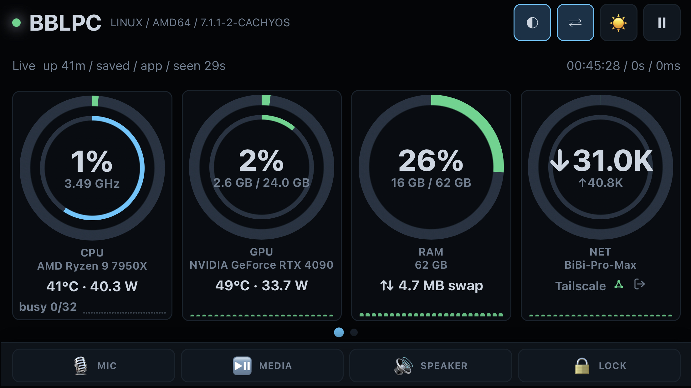
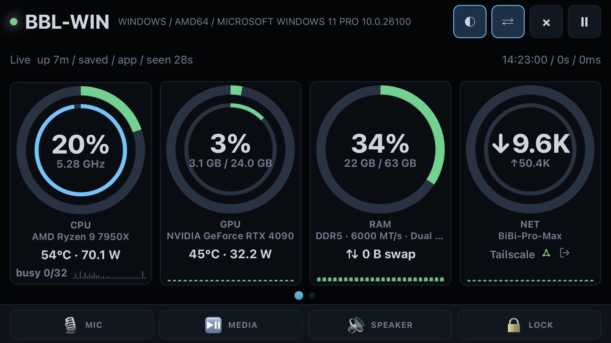

# Sysmon Agent

**Turn any old phone into a live system monitor for your PC.** One small binary serves a
beautiful dashboard — CPU, GPU, RAM, disk, network, temperatures, and power — as an
installable web app you add to your Home Screen. The host does all the work; the device
just paints the screen.

<p align="center">
  
  <br>
  <em>Linux host</em>
  <br><br>
  
  <br>
  <em>Windows host</em>
</p>

---

## See it live

The dashboard below is running on an **iPhone 8 Plus (2017)** as a Home-Screen web app —
**no cable, no companion app to install, no GPU.** The phone is just on Wi-Fi painting
HTML; every sensor is read on the host PC and pushed over the network. That's why a
years-old handset with nothing plugged in makes a perfect, near-zero-power desk monitor.

| Idle | Under CPU load |
| :---: | :---: |
|  |  |
| Gauges tick live at a glance | Same phone, host under load — the CPU **clock ring fills** and the temperature crosses its threshold and turns **amber**, in real time |

---

## Highlights

- 📱 **Installable PWA** — add it to any phone, tablet, or browser Home Screen. Runs great
  on old hardware.
- 🪶 **Light on the device** — the host collects everything and streams it; the phone only
  renders, so there's **no GPU use and almost no battery/CPU cost** on the device. Old,
  wireless, and always-on is exactly the point.
- 🧊 **Single binary, zero dependencies** — stdlib-only Go with all assets embedded. One
  file per OS, nothing to install alongside it.
- 🖥️ **Full-system telemetry** — CPU, GPU, RAM, disk, network, temperatures, and power,
  refreshing live over Server-Sent Events.
- 🎛️ **At-a-glance gauges** — concentric rings (CPU utilization outer, **core-clock
  inner**), a small live trend per card, and amber/red warning thresholds.
- 🔘 **Quick controls** — mute mic, play/pause media, mute speaker, and lock the screen
  straight from the dashboard footer.
- 🧮 **AI usage page** — an optional fourth page with Claude Code plan usage (5-hour
  session, weekly, per-model weeklies, usage credits), Codex quota, and a seven-day token
  chart for each. Reads the local files both tools already write; hidden unless you point
  the agent at a config directory.
- ♻️ **Graceful degradation** — a sensor that can't be read shows `unavailable` with a
  reason; it never breaks the rest of the dashboard.
- 🐧 🪟 **Cross-platform** — Linux (`/proc` + sysfs + RAPL) and Windows (native Win32 APIs +
  an embedded LibreHardwareMonitor bridge for CPU power, board temps, and the GPU hotspot).

---

## Get started

### Windows — one click

Download the latest **`SysmonAgent-Setup-<version>.exe`** from the
[**Releases page**](https://github.com/vantuan5644/sysmon-agent/releases/latest) and
double-click it. The wizard installs a background service, opens the firewall, and adds a
dashboard shortcut. The build is unsigned, so Windows SmartScreen shows a one-time
**"Windows protected your PC" → More info → Run anyway**.

### Linux / build from source

Needs **Go 1.22+** (only to build — a prebuilt binary has no Go requirement).

```bash
git clone https://github.com/vantuan5644/sysmon-agent system-monitor
cd system-monitor
./build.sh                 # -> ./sysmon-agent
./sysmon-agent             # serves on 0.0.0.0:9099
```

Open `http://HOST_IP:9099/` from any device on the same network.

### Add it to your phone

The dashboard is an installable PWA. Browsers only allow "install" over HTTPS, and the
easiest way to get that is [Tailscale Serve](https://tailscale.com/kb/1312/serve) (no
certificates to manage):

```bash
# agent already listening on 127.0.0.1:9099
sudo tailscale serve --bg --https=9443 http://127.0.0.1:9099
```

Open `https://TAILSCALE_HOST:9443/` on the device → **Add to Home Screen** (Safari) or
**Install app** (Chrome) → set the device's auto-lock to *Never* for an always-on monitor.
Any other HTTPS reverse proxy (Caddy, nginx, Cloudflare Tunnel) works too.

---

<details>
<summary><b>Run options &amp; endpoints</b></summary>

Defaults bind all interfaces on port `9099` (good for a trusted LAN or a Tailscale network).

```bash
./sysmon-agent                                       # 0.0.0.0:9099
./sysmon-agent -bind 127.0.0.1 -port 9099
./sysmon-agent -settings ./settings.json
./sysmon-agent -tls -cert ./cert.pem -key ./key.pem  # optional direct TLS (proxy is preferred)
SYSMON_BIND=127.0.0.1 SYSMON_PORT=9099 ./sysmon-agent
```

| Endpoint | Purpose |
| --- | --- |
| `/` | the dashboard |
| `/healthz` | cheap process liveness |
| `/readyz` | proves metrics are actually collectable |
| `/api/status` | agent metadata + active display settings |
| `/api/metrics` | the live metrics payload |
| `/api/stream` | Server-Sent Events live metrics push |
| `/api/osd` | small cached CPU/GPU payload for an on-screen display overlay |
| `/api/quota` | Claude Code quota + token history (AI usage page) |
| `/api/codex-usage` | Codex quota + token history (AI usage page) |

When bound to a wildcard like `0.0.0.0`, startup logs print likely dashboard URLs
(Tailscale addresses first), skipping virtual/container interfaces. Open the port through
the firewall only on trusted LAN or Tailscale networks.
</details>

<details>
<summary><b>Configuration (flags / env)</b></summary>

Display settings persist with `-settings PATH` (or `SYSMON_SETTINGS`). Refresh interval and
warning thresholds are **host-side** config (flags/env, not touch controls); a `0`/unset
value keeps the saved default.

| Flag / env | Range / default | Meaning |
| --- | --- | --- |
| `-bind` / `SYSMON_BIND` | `0.0.0.0` | HTTP bind address |
| `-port` / `SYSMON_PORT` | `9099` | HTTP listen port |
| `-fast-ms` / `SYSMON_FAST_MS` | min 100, default 200 | fast-lane (CPU/RAM) interval |
| `-slow-ms` / `SYSMON_SLOW_MS` | min 500, default 1500 | slow-lane (power/temps/disk/net/GPU) interval |
| `-refresh-ms` / `SYSMON_REFRESH_MS` | {250,500,1000,2000} | dashboard refresh interval |
| `-cpu-warn` / `-mem-warn` / `-disk-warn` / `-gpu-warn` | 50–90 | utilization warn thresholds (%) |
| `-temp-warn` / `SYSMON_TEMP_WARN` | 50–90 (°C) | temperature warn threshold |
| `-settings` / `SYSMON_SETTINGS` | path | optional JSON file for persisted settings |
| `-claude-config-dir` / `SYSMON_CLAUDE_CONFIG_DIR` | path | Claude Code config dir for the AI usage page (default `$CLAUDE_CONFIG_DIR`, then `$HOME/.claude`; missing = Claude section hidden) |
| `-claude-quota-poll` / `SYSMON_CLAUDE_QUOTA_POLL` | bool, off | also poll `api.anthropic.com` for quota instead of only reading local files |
| `-codex-config-dir` / `SYSMON_CODEX_CONFIG_DIR` | path | Codex config dir for the AI usage page (default `$CODEX_HOME`, then `$HOME/.codex`; missing = Codex section hidden) |
| `-codex-quota-poll` / `SYSMON_CODEX_QUOTA_POLL` | bool, off | refresh Codex quota every 5 min through the installed Codex CLI |
| `-codex-binary` / `SYSMON_CODEX_BINARY` | path | Codex CLI used by the poll (default: `codex` on `PATH`) |
| `-tls` / `SYSMON_TLS` | bool | enable direct TLS (`-cert`/`-key`) |
| `-self-check` / `-wait-health` / `-wait-ready` | bool | in-process checks / startup gates |

Invalid persisted settings are backed up with a `.bad-...` suffix and the agent starts with
defaults so the monitor still comes up.
</details>

<details>
<summary><b>Deploy as a service (Linux systemd / Windows service)</b></summary>

**Linux.** Two units ship under `deploy/`:

- [`deploy/sysmon-agent.user.service`](deploy/sysmon-agent.user.service) (recommended for
  desktops) runs under your per-user systemd manager so the **footer controls** (mic/media/
  speaker/lock) can reach PipeWire/PulseAudio, `playerctl`, and `loginctl lock-session`.
- [`deploy/sysmon-agent.service`](deploy/sysmon-agent.service) runs as a system service for
  headless hosts.

```bash
./build.sh
sudo install -m0755 sysmon-agent /usr/local/bin/sysmon-agent
# user unit:
install -m0644 deploy/sysmon-agent.user.service ~/.config/systemd/user/sysmon-agent.service
systemctl --user enable --now sysmon-agent.service
sudo loginctl enable-linger "$USER"
```

[`run-linux.sh`](run-linux.sh) rebuilds, reinstalls to `/usr/local/bin`, and restarts the
right unit. Don't add `ProtectSystem`/`PrivateDevices`/`ProtectKernelModules` — they break
the `/proc`, sysfs, hwmon, and RAPL reads.

**Windows.** `install-windows.ps1` registers a native `SysmonAgent` service (pure stdlib SCM
integration — the same binary is both console app and service). From an elevated PowerShell:

```powershell
.\install-windows.ps1 -Action Install
.\install-windows.ps1 -Action Install -TempWarn 85   # AMD: Tctl idles hot, 70 C warns constantly
.\install-windows.ps1 -Action Status      # probes /readyz, reports settings + AI usage sources
.\install-windows.ps1 -Action Update      # download + verify + swap + rollback
.\install-windows.ps1 -Action Uninstall
```

The service runs as **LocalSystem**, which is why it can load the LibreHardwareMonitor
kernel driver every boot. Don't run it interactively under an unprivileged account for
production, or CPU power and board temps degrade.

**Updating.** Three paths, in order of convenience:

1. **In-dashboard.** The agent checks for a newer release once at startup and every 24 h,
   and the dashboard shows a `vX.Y.Z available - Update` banner. One tap downloads the new
   binary, **SHA-256 verifies it against the release's `SHA256SUMS.txt`**, then hands it to
   a detached helper that stops the service, swaps the binary, restarts, polls `/readyz`,
   and **rolls back to the previous binary if the new one fails readiness**. The dashboard
   reloads itself once the new build is up. No SmartScreen prompt — that only fires on an
   interactive double-click, not when the service replaces its own binary.
2. **`-Action Update`** — the same download/verify/swap/rollback driven entirely from the
   script, with no in-app network calls. Good for a weekly elevated Scheduled Task:
   ```powershell
   .\install-windows.ps1 -Action Update -DryRun                 # report only
   .\install-windows.ps1 -Action Update -Force                  # reapply same version
   .\install-windows.ps1 -Action Update -UpdateVersion v1.2.3   # pin or downgrade
   ```
3. **Re-run the installer.** `SysmonAgent-Setup-<ver>.exe` stops the running service and
   waits for it to release the binary before overwriting, so upgrading in place works
   without uninstalling first.

Self-update is confined to the **LocalSystem Windows service** — console runs and Linux
hosts refuse it (HTTP 501) and should use the installer or the systemd/package path. Every
release **must** publish `SHA256SUMS.txt`: it is what authenticates the download before a
SYSTEM-privileged process executes it, and both engines refuse to update without it.

**Turning the check off.** It is on by default. Toggle `update_check_enabled` via
`POST /api/settings`, or hard-disable it host-side with `-no-update-check` /
`SYSMON_UPDATE_CHECK=0` (flag/env wins over the setting). Disabled means no outbound calls
at all. With the AI usage page left in its default files-only mode (no `-claude-quota-poll`,
no `-codex-quota-poll`), `api.github.com` is the only endpoint the agent ever contacts.
</details>

<details>
<summary><b>Metrics &amp; API</b></summary>

`GET /api/metrics` returns hostname/OS/arch/timestamp plus:

- **CPU** usage %, package power (W) when exposed, current + max/boost clock (MHz), die temp.
- **GPU** usage/VRAM/temp/power (NVIDIA via `nvidia-smi`; AMD/Intel via DRM sysfs on Linux),
  plus the NVIDIA hotspot where it can be read (see below).
- **RAM** used/total/%, **disk** per mounted local filesystem, **network** RX/TX per interface.
- **Temperatures** from Linux hwmon/thermal or Windows ACPI/LibreHardwareMonitor, and **PSU**
  total output power when a USB-linked smart PSU is present (Windows LHM bridge).

Unavailable sensors come back as `available: false` with an error string instead of failing
the request; `collection_errors` rolls them up into compact `name: reason` summaries.

A **resident sampler** keeps one warm snapshot refreshed by a fast lane (CPU/RAM, ~5 Hz) and
a slow lane (power/temps/disk/net/GPU, ~0.7 Hz), so `/api/metrics` reads memory instead of
spawning a collection per request. Concurrent requests share one in-flight collection, and
`/api/stream` pushes fresh snapshots over SSE with a keepalive every 15 s.

`GET /api/osd` serves a small cached payload (CPU usage and package temperature, GPU usage
and temperature) for an on-screen display such as a game-streaming overlay, without waking
the full dashboard collector. On Windows an independent one-second loop asks the resident
LibreHardwareMonitor bridge for CPU/GPU sensors only, and only while an OSD client is
active; hardware readings older than 3.5 s are suppressed. Other platforms currently serve
CPU usage there and report the hardware fields unavailable.
</details>

<details>
<summary><b>AI usage page (Claude Code + Codex)</b></summary>

An optional fourth swipe page: Claude Code plan usage (the 5-hour session window, the shared
weekly, any per-model weeklies, usage credits), Codex quota windows, and a rolling seven-day
token chart for each tool. It is **hidden unless at least one provider is configured**, so if
you use neither, the dashboard is exactly the three pages it has always been. A missing
directory disables only that provider.

```bash
./sysmon-agent -claude-config-dir ~/.claude -codex-config-dir ~/.codex
```

Claude defaults to `$CLAUDE_CONFIG_DIR`, then `$HOME/.claude`; Codex to `$CODEX_HOME`, then
`$HOME/.codex`. On the **Windows service** pass them explicitly (the installer defaults both
from the installing user's profile): the service runs as LocalSystem, whose home is the
systemprofile directory, so it can never discover your profile on its own.

**Token charts** are file-only for both tools and never read credentials. Claude totals come
from the response usage records under `projects/**/*.jsonl`, deduplicated per response;
Codex totals from `sessions/**/*.jsonl`. Each bar is one local calendar day and counts
input, cache, and output tokens once. Both trees are rescanned every 30 seconds.

**Claude quota.** By default the agent makes *no network calls for this at
all* — it reads two files Claude Code and its quota widget already maintain, `quota.json`
and `widgets/quota-live-cache.json`, and merges them: freshest source wins per window, and
rows only the API knows about (per-model weeklies, credits) are carried over labelled with
their own age rather than dropped. Files-first is deliberate — the usage endpoint
rate-limits hard, so a second poller would just fight whatever else is already polling.

`-claude-quota-poll` opts a host with no such widget into polling
`api.anthropic.com/api/oauth/usage` directly, every 5 minutes (backing off to 15 after a
rate-limit). The OAuth token Claude Code already stores is read per poll, sent only to
`api.anthropic.com`, and is never logged, persisted, or included in any response the agent
serves.

On the installed Windows service, pass `-ClaudeQuotaPoll` to `install-windows.ps1`
rather than hand-editing the service command line: `Get-BinaryPath` rebuilds that line
from the parameters on every install, so a manual edit is dropped by the next one.
Polling is what lets the page stay fresh with no Claude Code session open and no desktop
widget running — bounded by the OAuth token’s lifetime, since only Claude Code itself
refreshes it. Run one poller per account: the agent or the desktop widget, not both.

**Codex quota.** By default the quota windows come from the newest rate-limit event Codex
wrote to its session files, so they move only when Codex runs on this host. For current
numbers between conversations, add `-codex-quota-poll`: at startup and every five minutes
the agent starts a hidden, temporary `codex app-server --stdio` and calls
`account/rateLimits/read`. No conversation or model turn is started; Codex itself handles
authentication and the outbound request, using the configured directory as `CODEX_HOME`, and
the agent never parses, logs, or serves Codex credentials. Each lookup has a 20-second
timeout, and a failure keeps the last quota with an error and its real age. On the Windows
service use `install-windows.ps1 -CodexQuotaPoll` (optionally
`-CodexBinary C:\path\to\codex.exe`): the installer saves the CLI's absolute path, because
LocalSystem does not share your `PATH`.
</details>

<details>
<summary><b>NVIDIA GPU hotspot temperature</b></summary>

The GPU card adds `Hotspot NN°C` to its detail line when the hotspot sensor can be read
(`gpu.devices[].hotspot_temperature_celsius` in `/api/metrics`). It has no warning threshold
yet.

**Windows** needs nothing extra: the LibreHardwareMonitor bridge already reads `GPU Hot Spot`.
When two GPUs share a model name the reading stays unavailable, rather than risk showing it
on the wrong card.

**Linux** has no supported interface for it (`nvidia-smi` does not report it), so an optional
root helper reads it from a GPU register through a read-only `/dev/mem` mapping. Supported:
**RTX 3090** (`10de:2204`) and **RTX 4090** (`10de:2684`). The helper never writes to the GPU
and opens no socket; it publishes `/run/sysmon-gpu-hotspot/readings.json` every two seconds,
and the agent stays unprivileged and ignores readings older than six seconds. NVIDIA does not
document the register (the offset and decoding follow
[gddr6-core-junction-vram-temps](https://github.com/ThomasBaruzier/gddr6-core-junction-vram-temps/blob/6d8c5ecf633a8658d205fb2c24531bf87164912f/src/sensor.c)),
so compare the number against another tool before relying on it.

```bash
go build -trimpath -o sysmon-gpu-hotspot ./cmd/gpu-hotspot
./install-gpu-hotspot.sh                  # dry-run: supported GPU? lockdown? iomem=?
sudo ./install-gpu-hotspot.sh --apply     # installs deploy/sysmon-gpu-hotspot.service, starts it
cat /run/sysmon-gpu-hotspot/readings.json
sudo ./install-gpu-hotspot.sh --uninstall --apply
```

Two kernel settings can stand in the way, and the dry-run reports both:

- Kernels built with `CONFIG_IO_STRICT_DEVMEM` refuse `/dev/mem` reads of memory the nvidia
  driver has claimed unless `iomem=relaxed` is on the kernel command line. That widens
  `/dev/mem` access system-wide, so it is opt-in: `--enable-register-access` adds it on
  Limine (backing up `/etc/default/limine` first); for GRUB, systemd-boot and others the
  script prints the change to make by hand. Either way, reboot to activate it.
- Kernel lockdown, usually turned on by Secure Boot, blocks `/dev/mem` outright. The script
  warns about it and leaves it alone.
</details>

<details>
<summary><b>Platform notes</b></summary>

**Linux** — CPU/memory/disk/network from `/proc`; CPU package power from Intel/AMD RAPL
(`/sys/class/powercap`), unavailable on hosts without it; temperatures from `/sys/class/hwmon`
and `/sys/class/thermal`. NVIDIA needs `nvidia-smi` in `PATH`; AMD via the `amdgpu` DRM
sysfs; Intel iGPU is best-effort. Container/bridge and remote-mount interfaces are skipped.

**Windows** — live CPU/memory/process/network/disk-capacity numbers come from native Win32
APIs, so an open dashboard does not spawn a PowerShell per sample; bounded PowerShell/CIM
queries remain only for slow-changing data (hardware identity, pagefile, physical-disk
discovery) and the ACPI fallback. CPU package power and CPU/board/RAM
temperatures aren't exposed by any native Windows API, so the agent ships an embedded
**LibreHardwareMonitor bridge** (loads `LibreHardwareMonitorLib.dll` directly — no GUI, no
WMI). Install it **machine-wide** plus **PowerShell 7+** once, elevated:

```powershell
choco install librehardwaremonitor -y                # machine-wide (recommended)
winget install --scope machine Microsoft.PowerShell  # pwsh — required for the bridge
```

A per-user install lands in a profile the LocalSystem service can't read, so those sensors
silently go unavailable. The same bridge also reports PSU output power for USB-linked smart
PSUs (Corsair HXi/RMi, NZXT, Seasonic, …).

**USB-attached drives** — an NVMe or SATA drive in a USB enclosure usually reports no
temperature on either OS, because a generic SMART query does not pass through the USB
bridge chip. The storage panel says so (`USB enclosure: bridge does not expose live SMART
temperature`) instead of reporting a broken sensor.
</details>

<details>
<summary><b>Build the Windows installer</b></summary>

The `dist/` flow turns the source into a double-clickable installer, cross-compilable from
Linux/macOS/Windows (no wine):

```bash
./dist/build-installer.sh 1.0.0     # -> dist/out/SysmonAgent-Setup-1.0.0.exe (~3 MB)
./dist/build-windows.sh   1.0.0     # just the standalone exe, no installer
```

It cross-compiles a stripped, version-stamped exe with an embedded icon, then wraps it in an
NSIS Modern-UI wizard that runs the existing `install-windows.ps1` (service + firewall +
recovery + `/readyz` gate) and registers a clean uninstaller. Needs **Go 1.22+** and
**NSIS** (`makensis`; `apt install nsis` / `brew install nsis` / AUR `nsis`); ImageMagick is
optional for icon regeneration. For public distribution, sign the exe + installer to avoid
the SmartScreen warning.
</details>

<details>
<summary><b>Verify &amp; test</b></summary>

```bash
go test ./...                  # unit tests
go run . -self-check           # in-process HTTP checks, no socket
./verify-no-listen.sh          # gofmt + tests + vet + self-check + cross-compile + JS verifiers
./verify.sh                    # real-host smoke: build, start on :19099, check API/PWA/settings, stop
./verify-deployed.sh           # checks an already-running service + published device URL
```

`verify-deployed.sh` waits for a fresh real Home-Screen status-strip tap, proving the
installed PWA path works. Windows equivalents: `verify-windows.ps1`,
`verify-deployed-windows.ps1`.
</details>

---

## Requirements

Full host-side dependency matrix (Go, per-platform runtime tools, optional PowerShell /
LibreHardwareMonitor / Node) is in [REQUIREMENTS.md](REQUIREMENTS.md).

## License

[Creative Commons Attribution-NonCommercial 4.0 (CC-BY-NC 4.0)](LICENSE) — free to use,
share, and adapt for **non-commercial** purposes with credit. Commercial use requires a
separate license from the maintainer.
